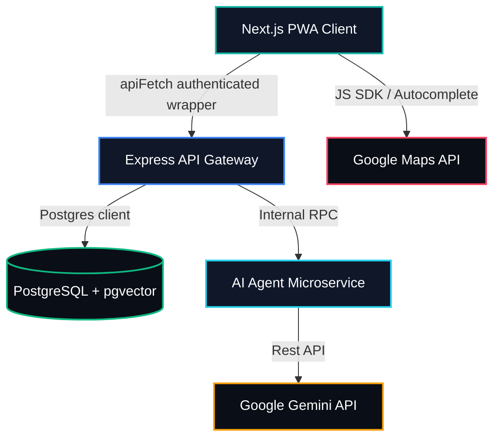

# SupplySync AI - Pitch Deck
**Vynedam Talent Hunt 2K26**
*Orchestrated by Person 5 (Integration, Maps, Infra & Demo Lead)*

---

## Slide 1: Title Slide
### Hyperlocal B2B Supply Chain Platform
**"Connecting local retail merchants with regional suppliers through real-time geocoded matching and AI-driven predictive logistics."**
- **Presented by**: Team SupplySync AI
- **Focus**: Efficiency, trust, and predictability for MSMEs.

---

## Slide 2: The Problem (MSME Pain Points)
### The Fragmentation of Retail Logistics
- **The Numbers (India MSME Context)**:
  - 63+ million MSMEs form the backbone of the economy, but operate in silos.
  - **40% higher logistics cost** due to micro-order inefficiencies and long-tail distribution structures.
  - **30% inventory wastage** for fresh goods due to lack of predictive demand forecasting.
- **Pain Points**:
  - Small retailers buy in micro-quantities at non-competitive prices.
  - Suppliers struggle with unpredictable routes, leading to late deliveries.
  - Lack of trust and clear metrics between buyers and suppliers.

---

## Slide 3: Existing Solutions' Gap
### Why Current Platforms Fall Short
| Feature | Legacy Aggregators | SupplySync AI |
| :--- | :--- | :--- |
| **Pricing** | Fixed high margins / Markups | AI Dynamic Pricing (fair badges) |
| **Logistics** | Centralized hubs (slow, costly) | Hyperlocal geocoded matching (fast, direct) |
| **Order Volume** | Bulk orders only or individual | AI-enabled Group-Buys (pool to unlock discount) |
| **Trust Verification** | Subjective, easily gamed reviews | Blockchain-like mathematical Trust Scores |

---

## Slide 4: Solution Overview
### The SupplySync AI Ecosystem
An integrated platform powered by Google Gemini AI and Google Maps API:
1. **Demand Forecasting Agent**: Analyzes historical buyer transactions to alert them when to restock *before* inventory runs out.
2. **Hyperlocal Geocoding & Distance Engine**: Draggable markers and geocoding options for optimal merchant onboarding.
3. **Dynamic Group-Buy Matchmaker**: Automatically groups neighboring buyer stores to unlock wholesale pricing.
4. **Algorithmic Trust Scoring**: Real-time score adjustments based on delivery timing and pricing behavior.

---

## Slide 5: Live Demo (The Golden Path)
### Step-by-Step System Flow
*Demonstrating a single live end-to-end integration thread:*
1. **Buyer Dashboard**: Open forecast alert, expand Gemini demand reasoning.
2. **Hyperlocal Group-Buys**: Buyer joins a nearby group pool; progress bar fills in real-time.
3. **Supplier Queue**: Incoming order appears instantly. Displays buyer distance and trust-scoring details.
4. **Dynamic Fair Pricing**: Supplier creates listing. Price checks automatically flag excessive pricing.
5. **Hyperlocal Map**: Live visual network densities of the pilot neighborhood.

---

## Slide 6: System Architecture
### Modular Monorepo Schema

---

## Slide 7: Market Sizing (Kukatpally, Hyderabad Pilot Area)
### Opportunity Valuation
- **Pilot Area**: Kukatpally / Madhapur neighborhood network containing ~2,000 active retail shops and 85 supplier hubs.

| Category | Definition | Valuation (Annualized) |
| :--- | :--- | :--- |
| **TAM** (Total Addressable Market) | Indian Retail MSME supply chain logistics market | **$120 Billion** |
| **SAM** (Serviceable Addressable Market) | Tech-enabled urban retail supply logistics in South India | **$18 Billion** |
| **SOM** (Serviceable Obtainable Market) | 5% penetration of retail merchants in major Tier-1 cities | **$900 Million** |

---

## Slide 8: Team & Roadmap (Future Scope)
### The Path Forward
- **Q3 2026**: Integrate multi-modal routing algorithms into Google Maps Distance Matrix.
- **Q4 2026**: Expand the group-buy matching from strict geographical radius to dynamic corridor pooling (along delivery truck routes).
- **Q1 2027**: Implement automatic smart contracts for dispute resolution based on trust events.
- **Q2 2027**: Roll out AI voice-guided ordering in local Indian languages (Telugu, Hindi, Kannada).

---

## Slide 9: Ask / Close
### Join Us in Revolutionizing Indian B2B Supply Chains
- **Seeking**: Strategic partnerships with logistics providers and local trade merchant associations for pilot expansions.
- **Let's Connect**:
  - Website: `https://supplysync.ai`
  - Email: `team@supplysync.ai`
  - Github: `github.com/supplysync-ai`
